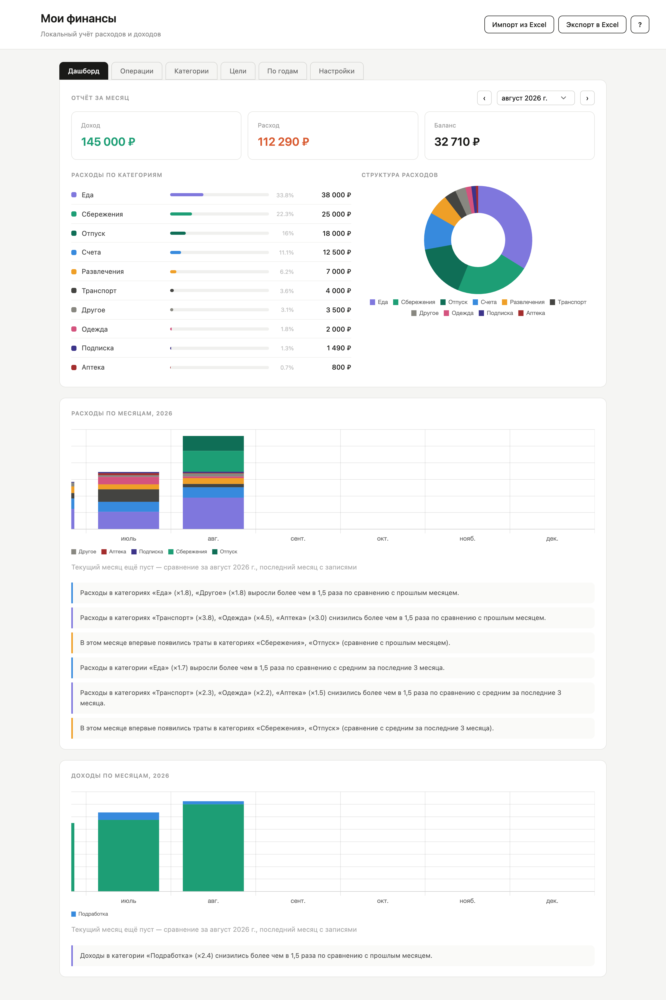
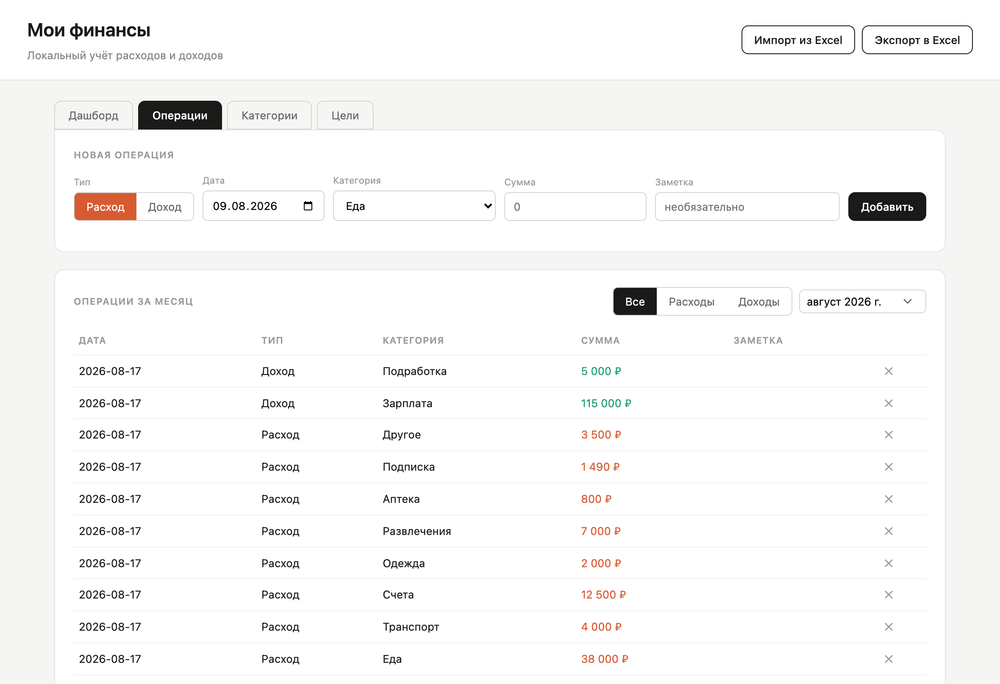
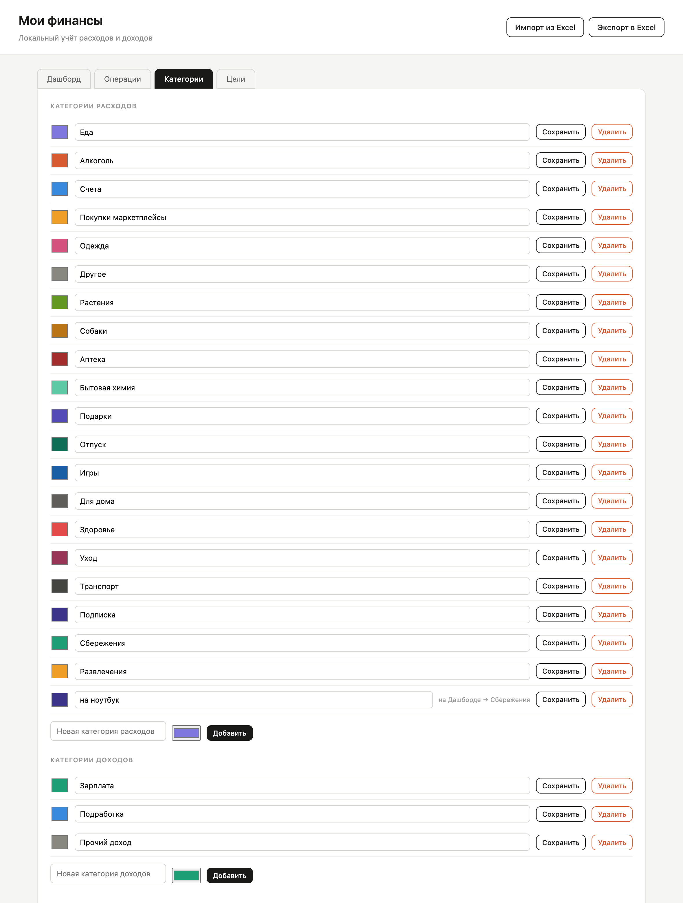
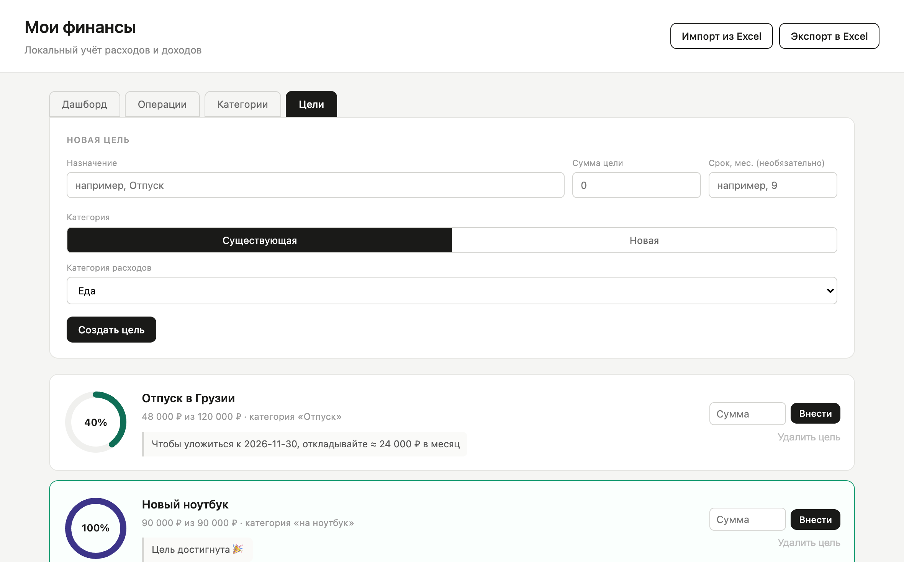
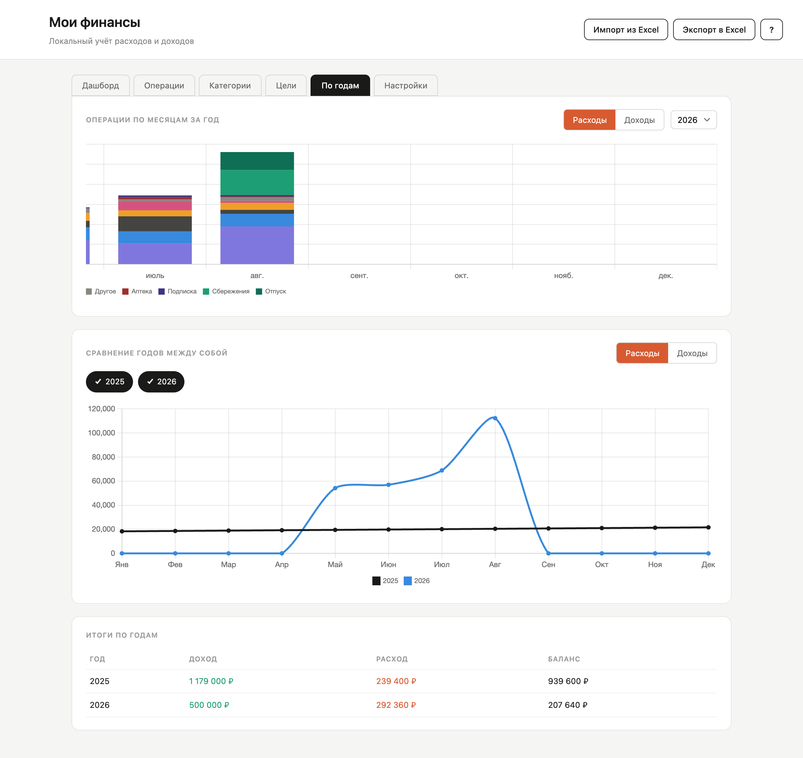

# Мои финансы

Локальный учёт личных расходов и доходов — веб-страница или отдельное приложение для Mac или Windows, на выбор. Все данные хранятся только на вашем компьютере — ничего не уходит в облако.

<p align="center">
  <a href="#веб-версия">
    
  </a>
  <a href="https://github.com/alpakafish/my-finances/releases/latest/download/My-Finances-mac-arm64.dmg">
    
  </a>
  <a href="https://github.com/alpakafish/my-finances/releases/latest/download/My-Finances-mac-x64.dmg">
    
  </a>
  <a href="https://github.com/alpakafish/my-finances/releases/latest/download/My-Finances-windows-x64.exe">
    
  </a>
  <br><br>

Не уверены, какой у вас Mac — Apple Silicon или Intel? См. [«Приложение для Mac»](#приложение-для-mac) ниже.

## Формат 

Два способа пользоваться — на выбор:

- **Веб-страница**, открывается в браузере на вашем компьютере;
- **Отдельное приложение для Mac или Windows** — то же самое, но отдельной программой, без браузера и без терминала.

## Скриншоты

**Дашборд** — отчёт за месяц, структура расходов (категории можно скрывать, нажимая на них в подписи под диаграммой), расходы и доходы по месяцам с автоматическими рекомендациями:



**Операции** — добавление операции и список за месяц с фильтром по типу; любую операцию можно изменить (✎) или удалить, удалённую по ошибке — вернуть кнопкой «Отменить» или сочетанием Cmd/Ctrl+Z:



**Категории** — управление категориями расходов и доходов, видно как категория цели «подшита» к «Сбережениям»:



**Цели** — накопление с кольцом прогресса, авторасчётом «сколько откладывать в месяц» и отметкой о достижении цели:



**По годам** — операции по месяцам за любой год из прошлого, и сравнение нескольких лет между собой на одном графике:



## Реализованный функционал

- Учёт операций: добавление, просмотр по месяцам с фильтром «Все/Расходы/Доходы» и по категории, изменение (дата, тип, категория, сумма, заметка — прямо в списке, кнопка ✎), удаление с возможностью отменить (кнопка в уведомлении или Cmd/Ctrl+Z)
- Поиск по заметке или сумме — ищет сразу по всей истории (не только за выбранный месяц), уважая фильтры по типу и категории
- Пометка операции «нал.» — для дохода или расхода, который не должен входить в общий итог за месяц/год и в Баланс (например, деньги мимо основного бюджета), но остаётся виден в разбивке по категориям и на графиках
- Повторяющиеся операции — отметьте «Повтор.» для зарплаты, аренды, подписок; при открытии нового месяца, где такой операции ещё нет, появится подсказка добавить её снова (сумму можно поправить) или пропустить на этот месяц
- Категории расходов и доходов: добавление, переименование, смена цвета, удаление с переносом операций
- Отчёт за месяц с диаграммами — расходы по категориям, структура расходов (с возможностью скрывать категории на диаграмме), расходы и доходы по месяцам за текущий год
- Лимиты расходов по категориям — необязательный лимит на месяц и/или год для любой категории расходов, с уведомлением при приближении и превышении
- Вкладка «По годам» — то же самое за любой выбранный год, плюс сравнение нескольких лет между собой
- Автоматические рекомендации — если расходы/доходы в категории заметно выросли, упали, впервые появились или пропали по сравнению с прошлым месяцем или средним за 3 месяца
- Цели накопления — сумма, необязательный срок с автоматическим пересчётом «сколько откладывать в месяц», кольцо прогресса, быстрый взнос
- Импорт и экспорт в Excel — включая перенос данных между устройствами и бэкап через собственный формат экспорта
- Автоматические резервные копии — раз в день, при открытии приложения, сохраняется копия всех данных (те же файлы, что при ручном «Экспорт в Excel»); хранятся последние 7, восстановить — через «Импорт из Excel»
- Настройки: валюта отображения (12 вариантов на выбор — меняет только символ и формат, без пересчёта старых операций по курсу), автоматические бэкапы (кнопка «Открыть папку с бэкапами» — в приложении для Mac/Windows, в вебе путь к папке показан текстом), полная очистка данных (с подтверждением), защита приложения паролем/Touch ID и проверка обновлений (в приложении для Mac), версия приложения с копированием в буфер
- Гид по приложению — кнопка «?» в правом верхнем углу показывает обзор возможностей ещё раз
- Полностью локальное хранение — ничего не отправляется во внешние сервисы

Не реализовано (возможные следующие шаги): мультивалютность.

## Как запустить

### Веб-версия

Нужен установленный Node.js версии 22 или новее (в macOS/Windows/Linux по умолчанию не входит — ставится отдельно один раз). Официальный установщик с LTS-версией (кнопка "LTS" на сайте) подходит.

<details>
<summary><b>Установка Node.js на macOS</b></summary>

Вариант 1 — официальный установщик: скачайте `.pkg` с [nodejs.org](https://nodejs.org/) (кнопка LTS) и установите как обычное приложение.

Вариант 2 — через [Homebrew](https://brew.sh/), если он уже установлен:
```bash
brew install node
```
</details>

<details>
<summary><b>Установка Node.js на Windows</b></summary>

Вариант 1 — официальный установщик: скачайте `.msi` с [nodejs.org](https://nodejs.org/) (кнопка LTS), запустите и пройдите мастер установки (Next → Next → Install).

Вариант 2 — через [winget](https://learn.microsoft.com/windows/package-manager/winget/) в PowerShell:
```powershell
winget install OpenJS.NodeJS.LTS
```
</details>

<details>
<summary><b>Установка Node.js на Linux</b></summary>

Проще и надёжнее всего — через [nvm](https://github.com/nvm-sh/nvm) (не зависит от версии в репозиториях дистрибутива):
```bash
curl -o- https://raw.githubusercontent.com/nvm-sh/nvm/v0.40.1/install.sh | bash
nvm install --lts
```

Либо через пакетный менеджер дистрибутива, например Ubuntu/Debian:
```bash
sudo apt update
sudo apt install nodejs npm
```
</details>

Проверить, что установка прошла успешно, можно командой `node -v` — она должна вывести версию (22.x или новее).

Дальше:

```bash
git clone https://github.com/alpakafish/my-finances.git
cd my-finances
npm install
npm start
```

Откроется сервер на [http://localhost:3000](http://localhost:3000) — откройте эту ссылку в браузере.

Либо на Mac просто дважды кликните `start.command` (на Windows — `start.bat`): скрипт сам поднимет сервер и откроет браузер.

Данные хранятся в `data/smeta.db` — это обычный файл, его можно скопировать для бэкапа или перенести на другой компьютер вместе с папкой проекта. Чтобы остановить сервер — закройте терминал/окно скрипта или нажмите `Ctrl+C`.

### Приложение для Mac

Отдельная программа — Node, npm и терминал не нужны, никакой браузер не открывается.

> Этот блок продублирован в описании каждого релиза на странице
> [Releases](https://github.com/alpakafish/my-finances/releases) — так его
> увидит и тот, кто не открывал README, а просто скачал файл.

1. На странице [Releases](https://github.com/alpakafish/my-finances/releases) скачайте:
   - `My Finances-*-arm64.dmg` — для Mac на Apple Silicon (M1/M2/M3/M4),
   - `My Finances-*.dmg` (без `arm64`) — для Mac на Intel.

   Не уверены, какой у вас Mac?  → «Об этом Mac» → строка «Чип»/«Процессор»:
   если там «Apple M…» — берите `arm64`, если «Intel» — второй файл.

2. Откройте скачанный `.dmg` и перетащите **My Finances** в папку **Applications**.

3. **При первом запуске macOS покажет «Файл «My Finances.app» не был
   открыт» / «Apple не может проверить, что это приложение не содержит
   вредоносного ПО»** — это ожидаемо: сборка пока не подписана платным
   сертификатом Apple Developer. Приложение при этом безопасно, просто
   Apple его не сертифицировала. Чтобы всё же открыть — один раз, дальше
   запускается как обычно:

   - Нажмите **«Готово»** в этом диалоге (не «Переместить в Корзину»).
   - Откройте **Системные настройки → Конфиденциальность и безопасность**
     (Privacy & Security), прокрутите вниз — там будет строка про
     My Finances и кнопка **«Всё равно открыть»** (Open Anyway). Нажмите её,
     подтвердите паролем или Touch ID при запросе.
   - Запустите «My Finances» ещё раз из Applications.

   (На части версий macOS есть и более короткий путь: правый клик
   (или Control+клик) по «My Finances» в Applications → **«Открыть»** → в
   появившемся диалоге снова **«Открыть»** — если такой пункт меню у вас
   есть, можно начать с него.)

   После этого при следующих запусках предупреждений больше не будет.

Данные хранятся в `~/Library/Application Support/My Finances/` — это стандартное место для данных приложений на Mac, обновления приложения его не затрагивают. Когда выйдет новая версия, приложение спросит, скачать ли её, а после скачивания предложит перезапуститься и установить. Проверить обновления вручную можно в Настройках, там же видна текущая версия приложения.

### Приложение для Windows

Отдельная программа — Node, npm и терминал не нужны, никакой браузер не открывается.

> Этот блок продублирован в описании каждого релиза на странице
> [Releases](https://github.com/alpakafish/my-finances/releases) — так его
> увидит и тот, кто не открывал README, а просто скачал файл.

1. На странице [Releases](https://github.com/alpakafish/my-finances/releases) скачайте
   `My-Finances-windows-x64.exe`.

2. Запустите скачанный `.exe` — откроется мастер установки. Можно выбрать папку установки,
   дальше «Далее» → «Установить».

3. **При запуске установщика (или самого приложения после установки) Windows может
   показать «Windows защитила ваш компьютер» (SmartScreen)** — это ожидаемо: сборка пока
   не подписана платным сертификатом (аналогично тому, как это устроено для Mac — см. выше).
   Приложение при этом безопасно, просто у него нет коммерческой цифровой подписи. Чтобы
   всё же запустить:

   - Нажмите **«Дополнительно»** («More info») на экране предупреждения.
   - Нажмите появившуюся кнопку **«Выполнить в любом случае»** («Run anyway»).

   После этого установка/запуск продолжится как обычно, дальнейшие запуски приложения
   предупреждений не показывают.

Данные хранятся в `%APPDATA%\My Finances\` — это стандартное место для данных приложений на
Windows, обновления приложения его не затрагивают. Когда выйдет новая версия, приложение
спросит, скачать ли её, а после скачивания предложит перезапуститься и установить. Проверить
обновления вручную можно в Настройках, там же видна текущая версия приложения.

## Безопасность

Приложение не собирает и никуда не отправляет ваши данные — всё хранится только на вашем компьютере. Секретов вроде паролей от сторонних сервисов в приложении нет — единственная интеграция, импорт/экспорт в Excel, работает полностью офлайн.

**Защита паролем/Touch ID** (Настройки → «Защищать приложение паролем», доступно в приложении для Mac и Windows): если включить, при каждом запуске нужно будет подтвердить личность, прежде чем откроется доступ к данным. На Mac можно использовать Touch ID (если доступен) или пароль от учётной записи; на Windows — пароль от учётной записи Windows (Touch ID/Windows Hello в текущей версии не поддерживается, только пароль).

- Если на Mac включён Touch ID — приложение сразу предложит его. Это стандартный системный диалог macOS — сам отпечаток пальца в приложение никогда не попадает.
- Если Touch ID недоступен или отменён — можно ввести пароль от учётной записи Mac. Он проверяется самой macOS, не сохраняется и никуда не передаётся.
- Если закрыть окно входа, не подтвердив личность, — приложение закрывается целиком, доступа к данным нет.

